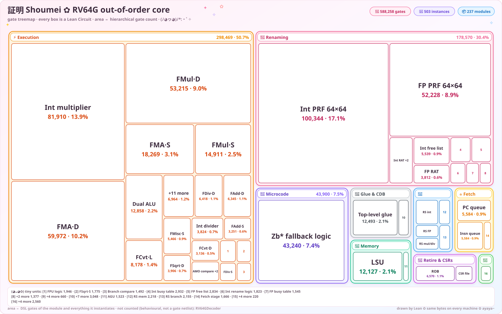

# Shoumei RTL

[](https://github.com/atvrager/Shoumei-RTL/actions/workflows/ci.yml)

**"Formally verified" hardware design with Lean 4 theorem proving.**

> Shoumei (証明, Japanese: proof) is a hardware design framework. Circuits live in Lean 4, and dependent types prove the properties. Code generators emit SystemVerilog, a flat netlist, ASAP7 gates and a cycle-accurate C++ model from the same proven source.

### Decoupled, timing-first load-store unit

The LSU is a two-stage decoupled memory engine targeting the synthesis
budgets in [docs/lsu-architecture.md](docs/lsu-architecture.md):

- **M1 to M2 load pipeline**: `lsu_stage1` holds the 64-bit AGU adder.
  The store-queue forwarding decision (age-ordered youngest match), byte
  extraction and CDB drive sit in `lsu_stage2` on registered values. No
  combinational path spans the stages.
- **Decoupled micro-ops**: STA (address) and STD (data) flow independently.
  `MemoryExecUnitDecoupled` emits `sta_valid/sta_addr` and
  `std_valid/std_data` as separate groups.
- **8-entry circular store queue** with explicit age masking (`older(i,j)`).
  1-cycle exact-match forwarding goes straight to the CDB. `replay_needed`
  signals partial word overlap (no byte merger in the critical path).
- **2-entry MSHR**: misses allocate a slot and free the request bus
  (hit-under-miss). The blocking single-load path no longer exists.
- Store data-path width is length-agnostic with a **128-bit base**: two
  64-bit memory ops per execution slot, vector-ready.


## What this is

A complete pipeline from formal specification to verified, simulated RTL:

1. **Define** circuits in a Lean 4 embedded DSL (gates, wires, instances)
2. **Prove** properties using Lean's type system (`native_decide`, structural induction)
3. **Generate** SystemVerilog, a flat netlist, ASAP7-mapped gates and C++ simulation from the same proven source
4. **Check** the emitted SystemVerilog elaborates (slang, plus a Yosys read/hierarchy pass)
5. **Simulate** with Verilator and C++ sim, validated against Spike ISA reference

```
                    Lean 4 DSL
              (theorems + proofs)
                       |
        +--------------+--------------+
        |              |              |
        v              v              v
   SystemVerilog    SV Netlist     C++ Sim
   (hierarchical)     (flat)     (cycle-accurate)
        |              |              |
        +------+-------+              |
               |                      |
               v                      v
      slang elaboration      Spike (libriscv)
      Verilator simulation            |
               |                      |
               +----------+-----------+
                          |
                          v
              Cosimulation (RVVI lock-step)
```

## Current status

**Complete `RV64IMAFD_Zicsr_Zifencei` (RV64G) "formally verified" out-of-order CPU.**
- Supported extensions: RV64I, M (64-bit multiply/divide), A (LR.W/SC.W/LR.D/SC.D/AMO), F (single-precision float), D (double-precision float), Zicsr (microcoded TrapSequencer + CSRFile), Zifencei.
- 107/107 official RISC-V architectural compliance suite (`riscv-arch-test`) tests passing in Verilator simulation and lock-step Spike cosimulation.
- 0 axioms in production proofs. Mutation testing confirms this.
- ASIC flows: GF180MCU at 64 MHz (15.625 ns) and ASAP7 at 1.0 GHz (1.000 ns). See [docs/physical-design.md](docs/physical-design.md).

*Interactive sunburst / 3D gate-city views and per-test pipeline traces are
[auto-published to GitHub Pages](https://atvrager.github.io/Shoumei-RTL/) on
every merge to `main`.*

| Category | Modules | Examples |
|----------|---------|---------|
| Arithmetic | 17 | FullAdder, KoggeStone, Subtractor, ALU64, PipelinedMultiplier64, Divider64 |
| Comparison | 5 | Comparator (4/6/8/32/64-bit) |
| Logic/Shift | 5 | LogicUnit, Barrel Shifter |
| Floating-Point | 16 | FPAdder (S/D), FPMultiplier (S/D), FPDivider, FPSqrt, FPToInt, IntToFP |
| Mux/Decoder | 14 | Decoder (1-6 bit), Mux (2:1 to 64:1), PriorityEncoder |
| Arbitration | 3 | PriorityArbiter (2/4/8/64-input) |
| Sequential | 16 | DFF, Register (1-91 bit), Queue, QueueN |
| RISC-V Pipeline | 35 | Decoder, RAT, FreeList, PhysRegFile, RS4, ROB, LSU, CSRFile, TrapSequencer, CPU top |

**Verification:**
- `bazel test //lean:shoumei` checks Lean proofs (structural and behavioral), and `verification/proof-coverage.sh` reports coverage
- Zero axioms in production circuits (`verification/mutation-test.sh` validates proof sensitivity)
- `CompositionalCert` justifies a module that is too large to discharge in one step from its sub-modules. The certificate's dependencies come from the circuit's instances
- slang elaborates the emitted SV, Verilator simulates it, and lock-step cosimulation runs against Spike

### Implementation progress

| Phase | Description | Status |
|-------|-------------|--------|
| 0 | Sequential DSL (DFF, Queue, Register) | Complete |
| 1 | Arithmetic (Adder, Subtractor, Comparator, ALU64) | Complete |
| 2 | RISC-V Decoder (RV64G all formats) | Complete |
| 3 | Register Renaming (RAT, FreeList, PhysRegFile) | Complete |
| 4 | Reservation Stations (RS4, Decoupled interfaces) | Complete |
| 5 | Execution Units (ALU, Multiplier, Divider, Memory, FPU) | Complete |
| 6 | ROB & Retirement (16-entry, in-order commit) | Complete |
| 7 | Memory System (LSU, StoreBuffer, TSO ordering) | Complete |
| 8 | CPU Integration (Out-of-Order CPU) | Complete |
| 9 | Privileged & System (Zicsr CSRs, Zifencei, TrapSequencer) | Complete |
| 10 | RV64G Migration (64-bit datapath, D-extension, 107/107 compliance) | Complete |
| 11 | Physical Design (ASAP7 1.0 GHz, GF180MCU 64 MHz, Synopsys DC) | Complete |

See [docs/ROADMAP.md](docs/ROADMAP.md) for future directions.

## Quick start

```bash
# Clone and setup
git clone --recurse-submodules https://github.com/atvrager/Shoumei-RTL.git
cd Shoumei-RTL

# Build the complete RTL and artifacts
bazel build //:rtl

# Run the complete presubmit test suite (311 tests)
bazel test //:presubmit

# Or run specific test suites:
bazel test //testbench:all_tests    # Verilator simulation, lockstep Spike cosim, spec sim
bazel test //verification:linters   # slang elaboration, shellcheck, python, cppcheck
```

### Prerequisites

- **Bazel** (>= 8.x) or **Bazelisk**
- **A C++ toolchain** for the Bazel actions

Bazel fetches every other tool. The build pins Lean 4 (`lean-toolchain`), Yosys,
Verilator, the RISC-V compiler, node, typescript and `pyslang` (`MODULE.bazel`).
No tool comes from the host PATH.

## How it works

### The DSL

A circuit is a Lean 4 structure with gates and submodule instances:

```lean
-- A 1-bit full adder
def fullAdderCircuit : Circuit :=
  { name := "FullAdder"
    inputs := [a, b, cin]
    outputs := [sum, cout]
    gates := [
      Gate.mkXOR a b ab_xor,
      Gate.mkXOR ab_xor cin sum,
      Gate.mkAND a b ab_and,
      Gate.mkAND cin ab_xor cin_ab,
      Gate.mkOR ab_and cin_ab cout
    ]
    instances := [] }
```

Larger circuits compose verified building blocks through `CircuitInstance`:

```lean
-- ReservationStation4 uses verified Register, Comparator, Mux, Arbiter instances
def mkReservationStation4 : Circuit :=
  { name := "ReservationStation4"
    instances := [
      { moduleName := "Register91", instName := "u_entry0", portMap := ... },
      { moduleName := "Comparator6", instName := "u_cdb_match0", portMap := ... },
      { moduleName := "PriorityArbiter4", instName := "u_ready_arb", portMap := ... },
      ...
    ]
    ... }
```

### Proofs

```lean
-- Structural: full adder has exactly 5 gates
theorem fullAdder_gate_count : fullAdderCircuit.gates.length = 5 := by native_decide

-- Behavioral: register file write-then-read returns written value
theorem physregfile_read_after_write (prf : PhysRegFileState n) (tag : Fin n) (val : UInt32) :
    (prf.write tag val).read tag = val := by simp [PhysRegFileState.write, PhysRegFileState.read]
```

### Verification

Lean establishes correctness. Then the project checks the emitted RTL by
elaborating and running it.

```bash
bazel test //verification:linters                         # slang elaboration, shellcheck, python, cppcheck
bazel test //testbench:sim_tests                          # Verilator simulation
bazel test //testbench:cosim_tests                        # RTL vs Spike lock-step cosim
bazel test //:presubmit                                   # Full presubmit suite (311 tests)
```

Large sequential modules get a compositional justification: a `CompositionalCert`
names the module and its composition proof. `bazel run //generators:generate_all -- --export-certs`
derives its dependencies from the circuit's instances. It fails if the certificate
names a module the generator does not emit.

## Documentation

| Document | Description |
|----------|-------------|
| [docs/getting-started.md](docs/getting-started.md) | Setup, build, simulation, and synthesis quick start |
| [docs/commands.md](docs/commands.md) | Comprehensive command and Make target reference |
| [docs/FEATURES.md](docs/FEATURES.md) | What's built: complete feature list |
| [docs/ROADMAP.md](docs/ROADMAP.md) | What's planned: near/medium/long-term |
| [AGENTS.md](AGENTS.md) | Development guide: procedures, workflows, conventions |
| [docs/ooo-design.md](docs/ooo-design.md) | RV64G microarchitecture specification |
| [docs/ooo-plan.md](docs/ooo-plan.md) | Implementation phase ledger and milestone history |
| [docs/physical-design.md](docs/physical-design.md) | OpenROAD, ASAP7 (1.0 GHz), GF180MCU (64 MHz), Synopsys DC |
| [docs/cosimulation.md](docs/cosimulation.md) | Lock-step cosimulation through RVVI and Spike |
| [docs/component-selection.md](docs/component-selection.md) | Adder/component selection and PDK technology mapping |
| [docs/adding-a-module.md](docs/adding-a-module.md) | Step-by-step guide for new modules |
| [docs/adding-an-extension.md](docs/adding-an-extension.md) | Step-by-step guide for adding ISA extensions |
| [docs/verification-guide.md](docs/verification-guide.md) | Proofs, certificates, elaboration, sim and cosim |
| [docs/proof-strategies.md](docs/proof-strategies.md) | Parameterized circuit proof techniques |
| [docs/lean-lsp-guide.md](docs/lean-lsp-guide.md) | Interactive proof development with Lean LSP |

## Technology stack

| Component | Tool | Version |
|-----------|------|---------|
| Theorem prover + DSL | Lean 4 | v4.34.1 |
| SV elaboration | Yosys + slang | system package / pip |
| RTL simulation | Verilator | system package |
| ISA reference | Spike (riscv-isa-sim) | built from source |
| Arcilator backend | CIRCT/firtool | 1.140.0 |
| CI | GitHub Actions | n/a |

## License

TBD
