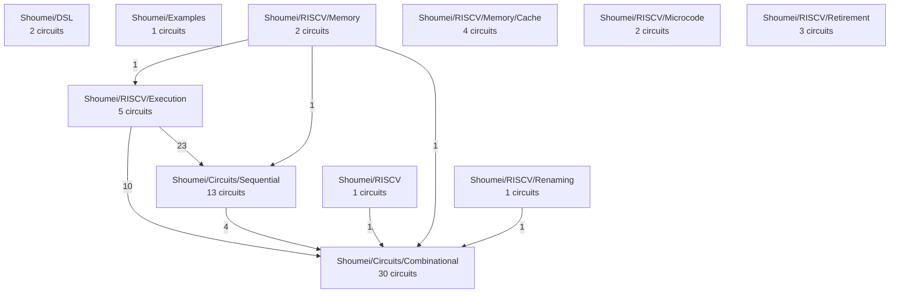

# Project Map

Generated by `scripts/gen-project-map.py` from the source tree — do
not edit by hand; re-run it.  Composition edges come from
`moduleName :=` references between circuits, certificates from the
Lean registry, docs from each file's leading comment block.

- Lean files: **198**
- Circuits with a literal `name :=` (graph nodes): **64**
- Compositional certificates (Lean registry): **77**
- Proof files: **49**

Parameterised builders (`mkQueueNStructural`, `mkRegisterN`,
`mkMuxTree`, `mkDecoder`, ...) construct their circuit names by
interpolation, so those circuits cannot be recovered by scanning for a
literal; they are enumerated in `GenerateAll.lean` and are not graph
nodes here.  Everything below is derived from `lean/` alone, which is
what lets `lint` assert the map is current.

## Subsystem composition

Edges are circuit instantiations that cross a directory boundary; the
label is how many distinct instantiations cross it.

## Coverage

| Circuit | Subsystem | Inst. | Cert | Proofs | Doc |
| :--- | :--- | ---: | :---: | :---: | :---: |
| `ALU32` | Shoumei/Circuits/Combinational | 8 |  | yes | yes |
| `ALU64` | Shoumei/Circuits/Combinational | 8 |  | yes | yes |
| `BitmapFreeList_64_W2` | Shoumei/RISCV/Renaming | 1 | yes |  | yes |
| `BranchExecUnit` | Shoumei/RISCV/Execution | 0 |  |  | yes |
| `CSACompressor64` | Shoumei/Circuits/Combinational | 4 |  | yes | yes |
| `Comparator32` | Shoumei/Circuits/Combinational | 2 |  | yes | yes |
| `Comparator64` | Shoumei/Circuits/Combinational | 2 |  | yes | yes |
| `DFlipFlop` | Shoumei/Circuits/Sequential | 0 |  | yes | yes |
| `Decoder0` | Shoumei/Circuits/Combinational | 0 |  |  | yes |
| `Divider32` | Shoumei/Circuits/Sequential | 2 | yes | yes | yes |
| `Divider64` | Shoumei/Circuits/Sequential | 2 | yes | yes | yes |
| `FPAdder` | Shoumei/Circuits/Sequential | 0 | yes | yes | yes |
| `FPAdderD` | Shoumei/Circuits/Sequential | 0 | yes | yes | yes |
| `FPDivider` | Shoumei/Circuits/Sequential | 0 | yes | yes | yes |
| `FPDividerD` | Shoumei/Circuits/Sequential | 0 | yes | yes | yes |
| `FPDoubleConverter` | Shoumei/Circuits/Combinational | 0 | yes | yes | yes |
| `FPDoubleMisc` | Shoumei/Circuits/Combinational | 0 | yes | yes | yes |
| `FPExecUnit` | Shoumei/RISCV/Execution | 15 | yes |  | yes |
| `FPExecUnit_D` | Shoumei/RISCV/Execution | 15 | yes |  | yes |
| `FPFMA` | Shoumei/Circuits/Sequential | 2 | yes | yes | yes |
| `FPFMAD` | Shoumei/Circuits/Sequential | 2 | yes | yes | yes |
| `FPLongConverter` | Shoumei/Circuits/Combinational | 0 |  | yes | yes |
| `FPMisc` | Shoumei/Circuits/Combinational | 0 | yes |  | yes |
| `FPMultiplier` | Shoumei/Circuits/Sequential | 0 | yes | yes | yes |
| `FPMultiplierD` | Shoumei/Circuits/Sequential | 0 | yes | yes | yes |
| `FPPack` | Shoumei/Circuits/Combinational | 0 |  |  | yes |
| `FPSqrt` | Shoumei/Circuits/Sequential | 0 | yes | yes | yes |
| `FPSqrtD` | Shoumei/Circuits/Sequential | 0 | yes | yes | yes |
| `FPUnpack` | Shoumei/Circuits/Combinational | 0 |  |  | yes |
| `FetchStage_W2` | Shoumei/RISCV | 1 |  | yes | yes |
| `FullAdder` | Shoumei/Examples | 0 |  | yes | yes |
| `KoggeStoneAdder32` | Shoumei/Circuits/Combinational | 0 |  | yes | yes |
| `KoggeStoneAdder64` | Shoumei/Circuits/Combinational | 0 |  |  | yes |
| `L1DCache` | Shoumei/RISCV/Memory/Cache | 0 | yes | yes | yes |
| `L1ICache` | Shoumei/RISCV/Memory/Cache | 0 | yes | yes | yes |
| `L2Cache` | Shoumei/RISCV/Memory/Cache | 0 | yes | yes | yes |
| `LSU` | Shoumei/RISCV/Memory | 2 | yes | yes | yes |
| `MemoryExecUnit` | Shoumei/RISCV/Execution | 1 |  | yes | yes |
| `MemoryHierarchy` | Shoumei/RISCV/Memory/Cache | 0 | yes | yes | yes |
| `MicrocodeDecoder` | Shoumei/RISCV/Microcode | 0 |  |  | yes |
| `MicrocodeSequencer` | Shoumei/RISCV/Microcode | 1 | yes | yes | yes |
| `Mul32x32To64` | Shoumei/Circuits/Combinational | 4 |  |  | yes |
| `MulDivExecUnit` | Shoumei/RISCV/Execution | 2 | yes | yes | yes |
| `Mux0` | Shoumei/Circuits/Combinational | 0 |  |  | yes |
| `MyModule` | Shoumei/DSL | 0 |  |  | yes |
| `OneHotEncoder64` | Shoumei/Circuits/Combinational | 0 |  |  | yes |
| `Pipeline` | Shoumei/DSL | 0 |  | yes | yes |
| `PipelinedMultiplier` | Shoumei/Circuits/Combinational | 5 | yes | yes | yes |
| `PipelinedMultiplier64` | Shoumei/Circuits/Combinational | 5 | yes |  | yes |
| `Popcount8` | Shoumei/Circuits/Combinational | 0 |  | yes | yes |
| `PriorityArbiter0` | Shoumei/Circuits/Combinational | 0 |  |  | yes |
| `Queue16x32` | Shoumei/RISCV/Retirement | 0 | yes |  | yes |
| `Queue16x32_DualPort` | Shoumei/RISCV/Retirement | 0 | yes |  | yes |
| `ROB16_W2` | Shoumei/RISCV/Retirement | 0 | yes | yes | yes |
| `RippleCarryAdder32` | Shoumei/Circuits/Combinational | 0 |  | yes | yes |
| `RippleCarryAdder4` | Shoumei/Circuits/Combinational | 0 |  | yes | yes |
| `RippleCarryAdder64` | Shoumei/Circuits/Combinational | 0 |  |  | yes |
| `RippleCarryAdder8` | Shoumei/Circuits/Combinational | 0 |  |  | yes |
| `Shifter32` | Shoumei/Circuits/Combinational | 0 |  | yes | yes |
| `Shifter4` | Shoumei/Circuits/Combinational | 0 |  | yes | yes |
| `Shifter64` | Shoumei/Circuits/Combinational | 0 |  | yes | yes |
| `StoreBuffer8` | Shoumei/RISCV/Memory | 2 | yes | yes | yes |
| `Subtractor32` | Shoumei/Circuits/Combinational | 2 |  | yes | yes |
| `Subtractor64` | Shoumei/Circuits/Combinational | 2 |  | yes | yes |

## Mechanical gaps

- **0** circuit files without a leading doc comment
- **20** circuits with no `*Proofs.lean` mentioning them
- **41** circuits that instantiate nothing (leaves)
- **32** circuits nothing else instantiates (tops)

## Known gaps (hand-maintained)

Not derivable from the tree; keep this list short and delete entries as
they land.

- No `Circuit satisfies Behavior` refinement atom: LEC relates the two emitted artifacts, the theorems talk about the behavioural models, and nothing joins the two.  This is the missing link that would let composition be mechanical.
- Certificates are unverified pointers: `CompositionalCert.proofReference` is a `String` and the LEC script only checks that dependencies were verified.
- Widths are not yet parameters: `CPUConfig.xlen` is unused, 91 data buses in `CPU.lean` are hard-wired to 32, and the behavioural models use `UInt32`. FLEN and VLEN are specified in docs/roadmap-rv32g-rv64g.md but not in code.
- The flat netlist emitter (`SystemVerilogNetlist.lean`) is combinational-only: it drops DFFs and clock/reset, and full instance inlining does not scale (8.7 MB for one module).
- The CPU top-level has no compositional certificate, so it is the dominant cost of a full LEC run.
- Pre-existing FP-store race: `fsw` intermittently enqueues a zero operand into the store buffer (timing-dependent, value-independent).

