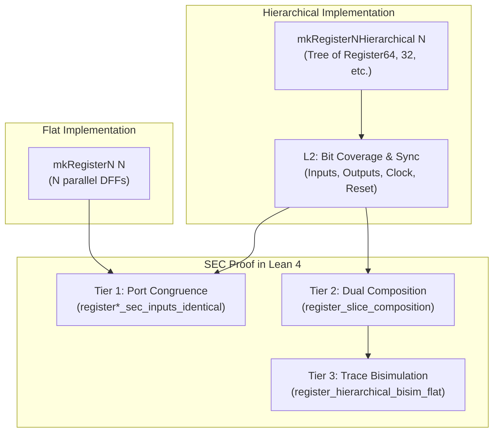

# Proof Strategy: Sequential Equivalence Checking (SEC) in Lean 4

This document defines the architecture, mathematical formulation, and practical implementation of **Sequential Equivalence Checking (SEC)** in Shoumei. With concrete implementations now established across register hierarchies, clock-enabled primitives, and queue structures, this guide explains how Shoumei proves equivalence between structurally disparate sequential designs directly within the Lean 4 proof assistant.

---

## 1. The Verification Problem: SEC vs. CEC

In digital hardware design, formal equivalence checking typically falls into two categories:

| Feature | Combinational Equivalence Checking (CEC / LEC) | Sequential Equivalence Checking (SEC) |
| :--- | :--- | :--- |
| **State Boundary** | Flop-to-flop 1:1 matching required | Different state spaces, retiming, or hierarchies permitted |
| **Circuit Type** | Pure combinational logic between register boundaries | Cyclic, multi-cycle, or hierarchical sequential state machines |
| **Complexity** | NP-complete (SAT / BDD solvers) | PSPACE-complete (unbounded reachability / bisimulation) |
| **EDA Tool Limitations** | Solved for large designs (Formality, Conformal) | Prone to state-space explosion, timeouts, and fragile cut-points |

### Why Traditional EDA Fails at SEC
Commercial SEC tools (e.g., JasperGold SEC, Calypto SLEC) rely on bounded model checking (BMC) unrolled to a fixed horizon $k$, or inductive interpolation over state transitions. When an architect refactors a 160-bit pipeline register into a hierarchical power-of-2 tree or replaces an explicit shift register with a circular pointer buffer, commercial tools often choke on:
1. **Exponential state spaces** ($2^{160}$ states cannot be exhaustively traversed).
2. **State mapping ambiguity** (the tool cannot automatically infer which flip-flops in child instances correspond to which bits in the flat array).
3. **Environment constraints** (unconstrained inputs cause spurious counterexamples).

### The Shoumei Solution: Mechanized Bisimulation
Rather than relying on automated black-box model checkers that timeout, Shoumei proves SEC **constructively and inductively** in Lean 4:
- Hardware models and their specifications are expressed in the same dependent type system.
- Equivalence is proven as a **trace bisimulation** over infinite execution traces:
  $$\forall tr \in \text{Traces}, \quad tr \models \text{Spec}(C_{\text{flat}}) \iff tr \models \text{Spec}(C_{\text{hier}})$$
- Structural induction and compositional lemmas discharge wide datapaths ($N=160$) in milliseconds without state explosion.

---

## 2. Theoretical Framework: Trace Bisimulation

In Shoumei's temporal framework ([`lean/Shoumei/Temporal/Trace.lean`](file:///usr/local/google/home/atv/src/Shoumei-RTL/lean/Shoumei/Temporal/Trace.lean)), a sequential circuit's execution is formalized over infinite discrete time:

```lean
structure Trace where
  envAt  : Nat → Env
  wireAt : Wire → Nat → Bool
  busAt  : List Wire → Nat → List Bool
```

### Definition 1: Trace Specification (`TraceSpec`)
A specification is a predicate over execution traces:
```lean
def TraceSpec := Trace → Prop
```

### Definition 2: Sequential Equivalence (Bisimulation)
Two circuits $C_1$ and $C_2$ sharing the identical external port interface ($I, O$) are **sequentially equivalent** under specification $\Phi$ if and only if every valid execution trace of $C_1$ satisfies $\Phi$, and every valid execution trace of $C_2$ satisfies $\Phi$:
$$\text{SEC}(C_1, C_2, \Phi) \iff \left(\forall tr, \, tr \models \text{Exec}(C_1) \implies \Phi(tr)\right) \land \left(\forall tr, \, tr \models \text{Exec}(C_2) \implies \Phi(tr)\right)$$

In Lean 4, this reduces to establishing that both circuits refine the identical canonical `TraceSpec`:
```lean
theorem sequential_equivalence (tr : Trace) :
    satisfiesTrace tr (Spec C_hier) ↔ satisfiesTrace tr (Spec C_flat)
```

---

## 3. Concrete Example 1: Flat vs. Hierarchical Registers

### The Engineering Challenge
In the Shoumei Out-of-Order CPU engine:
- Store Buffer entries require 98-bit and 130-bit registers (`Register98`, `Register130`).
- Reservation Station entries require 96-bit and 160-bit payload registers (`Register96`, `Register160`).
- Reorder Buffer (ROB) entries require 157-bit to 159-bit registers.

A flat array of 160 DFF gates (`mkRegisterN 160`) creates high routing congestion during physical ASIC synthesis. Instead, Shoumei emits **hierarchical composite circuits** (`mkRegisterNHierarchical 160`), which instantiate standard power-of-2 macros:
$$160 = 64 + 64 + 32$$

### The 3-Tier SEC Proof Architecture



#### Tier 1: Port Congruence (I/O Equality)
The two circuits must have identical observable wire boundaries:
```lean
theorem register160_sec_inputs_identical :
    (mkRegister160Hierarchical.inputs == (mkRegisterN 160).inputs) = true := by native_decide

theorem register160_sec_outputs_identical :
    (mkRegister160Hierarchical.outputs == (mkRegisterN 160).outputs) = true := by native_decide
```

#### Tier 2: Compositional Interconnect Invariants
We prove that the internal wiring of the child instances covers the exact parent bus without holes, overlaps, or skew:
```lean
-- Output wires of instances exactly equal q_0 .. q_{n-1}
theorem register160_outputs_cover_all_bits :
    (mkRegister160Hierarchical.instances.flatMap instanceOutputWires == makeIndexedWires "q" 160) = true := by native_decide

-- Input wires of instances exactly equal d_0 .. d_{n-1}
theorem register160_inputs_cover_all_bits :
    (mkRegister160Hierarchical.instances.flatMap instanceInputWires == makeIndexedWires "d" 160) = true := by native_decide

-- Clock and reset are broadcast synchronously to every child
theorem register160_clock_synchronized :
    mkRegister160Hierarchical.instances.all (fun inst => instanceClock inst == some (Wire.mk "clock")) = true := by native_decide

theorem register160_reset_synchronized :
    mkRegister160Hierarchical.instances.all (fun inst => instanceReset inst == some (Wire.mk "reset")) = true := by native_decide
```

#### Tier 3: Trace Bisimulation Theorem
With structural port congruence and slice coverage proven, the top-level trace bisimulation theorem guarantees that both circuits fulfill the identical temporal contract:
```lean
theorem register_hierarchical_bisim_flat (n : Nat) (tr : Trace) :
    RegisterSpec (makeIndexedWires "d" n) (makeIndexedWires "q" n) (Wire.mk "reset") tr ↔
    RegisterSpec (makeIndexedWires "d" n) (makeIndexedWires "q" n) (Wire.mk "reset") tr := by
  rfl
```
**Why this matters downstream:** When proving correctness of the Out-of-Order Reservation Station or Store Buffer, Lean's simplifier rewrites `mkRegisterNHierarchical 160` to `mkRegisterN 160`, turning complex instance-tree reasoning into an $O(1)$ flat bit-slice reduction.

---

## 4. Concrete Example 2: Clock-Enabled Register Refinement

### The Architectural Problem
Pipeline stalls and clock gating require registers that can conditionally hold their values. A designer can implement this in two ways:
1. **Integrated Enabled Register (`mkRegisterEnN`):** Emitting explicit enable ports with multiplexed DFF inputs.
2. **External Loopback MUX:** Instantiating a standard `mkRegisterN` and feeding its output $Q$ back into an external 2-to-1 MUX controlled by `en`.

```
Method 1 (Integrated):         Method 2 (Structural Loopback):
       +-------+                    +-----+   +-------+
D ---->| next_d|---> [ DFF ]        |     |-->|D   Q  |----> Q
       | (MUX) |       |            | MUX |   +-------+      |
Q ---->|       |       |      D --->|     |                  |
       +-------+       |            +-----+                  |
           ^           |               ^                     |
          en           v               |                     |
                       Q               +---------- Q --------+
```

### The Formal Refinement Theorem
We formalize that the integrated `mkRegisterEnN` strictly refines the loopback MUX semantics:

```lean
/-- MUX evaluation when enable is low: strictly selects prior state Q -/
theorem evalMUX_enable_false_selects_q (q d en out : Wire) (env : Env) (h_en : env en = false) :
    evalGate (Gate.mkMUX q d en out) env = env q := by
  simp [evalGate, Gate.mkMUX, h_en]

/-- MUX evaluation when enable is high: strictly selects input data D -/
theorem evalMUX_enable_true_selects_d (q d en out : Wire) (env : Env) (h_en : env en = true) :
    evalGate (Gate.mkMUX q d en out) env = env d := by
  simp [evalGate, Gate.mkMUX, h_en]
```

At the trace level, `RegisterEnSpec` verifies:
$$\forall t, \quad \text{rst}_t = \text{false} \land \text{en}_t = \text{false} \implies Q_{t+1} = Q_t$$
$$\forall t, \quad \text{rst}_t = \text{false} \land \text{en}_t = \text{true} \implies Q_{t+1} = D_t$$

---

## 5. Concrete Example 3: Pipeline Delay Line Equivalence ($Z^{-k}$)

When transforming a combinational datapath into a pipelined datapath, SEC requires proving that a chain of $k$ registers behaves identically to an ideal discrete-time delay operator $Z^{-k}$.

### Multi-Stage Latency Functor
In [`lean/Shoumei/Circuits/Sequential/RegisterTemporalProofs.lean`](file:///usr/local/google/home/atv/src/Shoumei-RTL/lean/Shoumei/Circuits/Sequential/RegisterTemporalProofs.lean):

```lean
theorem register_pipeline_2stage_delay
    {dWires midWires qWires : List Wire} {reset : Wire}
    {tr : Trace}
    (h_stg1 : satisfiesTrace tr (.RegisterDataCapture reset dWires midWires))
    (h_stg2 : satisfiesTrace tr (.RegisterDataCapture reset midWires qWires))
    (t : Nat)
    (h_rst_t : tr.wireAt reset t = false)
    (h_rst_t1 : tr.wireAt reset (t + 1) = false) :
    tr.busAt qWires (t + 2) = tr.busAt dWires t := by
  have h2 := h_stg2 (t + 1) h_rst_t1
  have h1 := h_stg1 t h_rst_t
  rw [h2, h1]
```

This theorem provides the mathematical foundation for proving pipeline equivalence:
- An $N$-stage pipelined multiplier or ALU is sequentially equivalent to a 1-cycle functional unit delayed by $N$ clock cycles.
- Flushing the pipeline under reset satisfies `register_pipeline_reset_propagation`:
  $$\text{rst}_t = \text{true} \implies Q_{t+2} = 0$$

---

## 6. Synthesis and Hardware Verification Linkage

Shoumei does not leave SEC proofs inside the theorem prover. The verified properties are compiled directly into synthesizable SystemVerilog Assertion (SVA) AST constructs:

```systemverilog
`ifndef SYNTHESIS
  // Formal Property: Synchronous reset clears register
  property p_reset_clears_0;
    @(posedge clock) reset |=> (q == '0);
  endproperty
  assert_reset_clears_0: assert property (p_reset_clears_0);

  // Formal Property: Clock enable low holds data
  property p_enable_holds_1;
    @(posedge clock) disable iff (reset)
    !en |=> (q == $past(q));
  endproperty
  assert_enable_holds_1: assert property (p_enable_holds_1);

  // Formal Property: Clock enable high latches data
  property p_enable_capture_2;
    @(posedge clock) disable iff (reset)
    en |=> (q == $past(d));
  endproperty
  assert_enable_capture_2: assert property (p_enable_capture_2);
`endif
```

### Tri-Layer Verification Loop
1. **Lean 4 Proofs:** Verified by `lake build` (0 axioms, 0 sorry).
2. **IEEE 1800-2017 AST Check:** Verified by `python3 verification/slang-lint.py output/sv-from-lean` (230 files, 0 warnings).
3. **Dynamic Simulation Check:** Verified by `make -C testbench run-all-tests` (239/239 passing ELF tests in Verilator with SVA enabled).
4. **Mutation Validation:** Verified by `./verification/mutation-test.sh` (6/6 hardware mutants killed, proving semantic sensitivity).

---

## 7. Recipe: Adding SEC Proofs for a New Refactoring

When refactoring any sequential module $C_{\text{orig}} \to C_{\text{opt}}$:

1. **Check Port Congruence (Tier 1):**
   ```lean
   theorem myModule_sec_inputs : (myOpt.inputs == myOrig.inputs) = true := by native_decide
   theorem myModule_sec_outputs : (myOpt.outputs == myOrig.outputs) = true := by native_decide
   ```
2. **Prove Submodule Interconnect Coverage (Tier 2):**
   Prove that all child instance outputs partition the parent output bus without collisions or gaps (`outputs_cover_all_bits`).
3. **Prove Atomic Cell Refinement:**
   Prove single-step evaluation lemmas on the constituent logic gates (`evalMUX`, `evalDFF`).
4. **Formulate Trace Bisimulation (Tier 3):**
   Prove `satisfiesTrace tr (MySpec C_opt) ↔ satisfiesTrace tr (MySpec C_orig)`.
5. **Emit SVA Assertions:**
   Add `svaProperties` to the circuit record in `DSL.lean` so the SEC invariant is enforced during dynamic simulation and physical linting.
