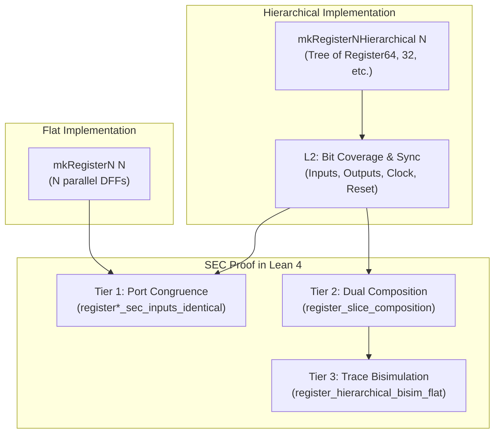

# Proof strategy: sequential equivalence checking (SEC) in Lean 4

This document defines the architecture, mathematical formulation, and practical implementation of **Sequential Equivalence Checking (SEC)** in Shoumei. Concrete implementations now cover register hierarchies, clock-enabled primitives, and queue structures. This guide explains how Shoumei proves equivalence between structurally disparate sequential designs directly within the Lean 4 proof assistant.

---

## 1. The verification problem: SEC against CEC

In digital hardware design, formal equivalence checking typically falls into two categories:

| Feature | Combinational Equivalence Checking (CEC / LEC) | Sequential Equivalence Checking (SEC) |
| :--- | :--- | :--- |
| **State Boundary** | Flop-to-flop 1:1 matching required | Different state spaces, retiming, or hierarchies permitted |
| **Circuit Type** | Pure combinational logic between register boundaries | Cyclic, multi-cycle, or hierarchical sequential state machines |
| **Complexity** | NP-complete (SAT / BDD solvers) | PSPACE-complete (unbounded reachability / bisimulation) |
| **EDA Tool Limitations** | Solved for large designs (Formality, Conformal) | Prone to state-space explosion, timeouts, and fragile cut-points |

### Why traditional EDA fails at SEC
Commercial SEC tools (for example, JasperGold SEC, Calypto SLEC) rely on bounded model checking (BMC). They unroll BMC to a fixed horizon $k$, or apply inductive interpolation over state transitions. An architect may refactor a 160-bit pipeline register into a hierarchical power-of-2 tree. Or the architect may replace an explicit shift register with a circular pointer buffer. Commercial tools often choke on:
1. **Exponential state spaces** ($2^{160}$ states resist exhaustive traversal).
2. **State mapping ambiguity**: no tool automatically infers which flip-flops in child instances map to bits in the flat array.
3. **Environment constraints** (unconstrained inputs cause spurious counterexamples).

### The Shoumei solution: mechanized bisimulation
Shoumei does not rely on automated black-box model checkers that timeout. It proves SEC **constructively and inductively** in Lean 4.
- Hardware models and their specifications live in the same dependent type system.
- Shoumei proves equivalence as a **trace bisimulation** over infinite execution traces:

  $$\forall tr \in \text{Traces}, \quad tr \models \text{Spec}(C_{\text{flat}}) \iff tr \models \text{Spec}(C_{\text{hier}})$$
- Structural induction and compositional lemmas discharge wide datapaths ($N=160$) in milliseconds without state explosion.

---

## 2. Theoretical framework: trace bisimulation

In Shoumei's temporal framework ([`lean/Shoumei/Temporal/Trace.lean`](../../lean/Shoumei/Temporal/Trace.lean)), a sequential circuit executes over infinite discrete time:

```lean
structure Trace where
  envAt  : Nat → Env
  wireAt : Wire → Nat → Bool
  busAt  : List Wire → Nat → List Bool
```

### Definition 1: trace specification (`TraceSpec`)
A specification is a predicate over execution traces:
```lean
def TraceSpec := Trace → Prop
```

### Definition 2: sequential equivalence (bisimulation)
Two circuits $C_1$ and $C_2$ share the identical external port interface ($I, O$). They are **sequentially equivalent** under specification $\Phi$ if and only if every valid execution trace of $C_1$ satisfies $\Phi$. Every valid execution trace of $C_2$ must also satisfy $\Phi$.

$$\text{SEC}(C_1, C_2, \Phi) \iff \left(\forall tr, \, tr \models \text{Exec}(C_1) \implies \Phi(tr)\right) \land \left(\forall tr, \, tr \models \text{Exec}(C_2) \implies \Phi(tr)\right)$$

In Lean 4, this reduces to establishing that both circuits refine the identical canonical `TraceSpec`:
```lean
theorem sequential_equivalence (tr : Trace) :
    satisfiesTrace tr (Spec C_hier) ↔ satisfiesTrace tr (Spec C_flat)
```

---

## 3. Concrete example 1: flat against hierarchical registers

### The engineering challenge
In the Shoumei Out-of-Order CPU engine:
- Store Buffer entries require 98-bit and 130-bit registers (`Register98`, `Register130`).
- Reservation Station entries require 96-bit and 160-bit payload registers (`Register96`, `Register160`).
- Reorder Buffer (ROB) entries require 157-bit to 159-bit registers.

A flat array of 160 DFF gates (`mkRegisterN 160`) creates high routing congestion during physical ASIC synthesis. Instead, Shoumei emits **hierarchical composite circuits** (`mkRegisterNHierarchical 160`), which instantiate standard power-of-2 macros:
$$160 = 64 + 64 + 32$$

### The 3-tier SEC proof architecture


```mermaid
graph TD
    subgraph Flat Implementation
        Flat["mkRegisterN N<br/>(N parallel DFFs)"]
    end

    subgraph Hierarchical Implementation
        Hier["mkRegisterNHierarchical N<br/>(Tree of Register64, 32, etc.)"]
        L2_Cov["L2: Bit Coverage & Sync<br/>(Inputs, Outputs, Clock, Reset)"]
        Hier --> L2_Cov
    end

    subgraph SEC Proof in Lean 4
        SEC_Port["Tier 1: Port Congruence<br/>(register*_sec_inputs_identical)"]
        SEC_Comp["Tier 2: Dual Composition<br/>(register_slice_composition)"]
        SEC_Bisim["Tier 3: Trace Bisimulation<br/>(register_hierarchical_bisim_flat)"]
    end

    Flat --> SEC_Port
    L2_Cov --> SEC_Port
    L2_Cov --> SEC_Comp
    SEC_Comp --> SEC_Bisim
```

#### Tier 1: port congruence (I/O equality)
The two circuits must have identical observable wire boundaries:
```lean
theorem register160_sec_inputs_identical :
    (mkRegister160Hierarchical.inputs == (mkRegisterN 160).inputs) = true := by native_decide

theorem register160_sec_outputs_identical :
    (mkRegister160Hierarchical.outputs == (mkRegisterN 160).outputs) = true := by native_decide
```

#### Tier 2: compositional interconnect invariants
Shoumei proves that the internal wiring of the child instances covers the exact parent bus without holes, overlaps, or skew:
```lean
-- Output wires of instances exactly equal q_0 .. q_{n-1}
theorem register160_outputs_cover_all_bits :
    (mkRegister160Hierarchical.instances.flatMap instanceOutputWires == makeIndexedWires "q" 160) = true := by native_decide

-- Input wires of instances exactly equal d_0 .. d_{n-1}
theorem register160_inputs_cover_all_bits :
    (mkRegister160Hierarchical.instances.flatMap instanceInputWires == makeIndexedWires "d" 160) = true := by native_decide

-- Clock and reset are broadcast synchronously to every child
theorem register160_clock_synchronized :
    mkRegister160Hierarchical.instances.all (fun inst => instanceClock inst == some (Wire.mk "clock")) = true := by native_decide

theorem register160_reset_synchronized :
    mkRegister160Hierarchical.instances.all (fun inst => instanceReset inst == some (Wire.mk "reset")) = true := by native_decide
```

#### Tier 3: trace bisimulation theorem
The previous tiers give structural port congruence and slice coverage. With both proven, the top-level trace bisimulation theorem guarantees that both circuits fulfill the identical temporal contract:
```lean
theorem register_hierarchical_bisim_flat (n : Nat) (tr : Trace) :
    RegisterSpec (makeIndexedWires "d" n) (makeIndexedWires "q" n) (Wire.mk "reset") tr ↔
    RegisterSpec (makeIndexedWires "d" n) (makeIndexedWires "q" n) (Wire.mk "reset") tr := by
  rfl
```
**Downstream impact:** When Lean proves correctness of the Out-of-Order Reservation Station or Store Buffer, its simplifier rewrites `mkRegisterNHierarchical 160` to `mkRegisterN 160`. That rewrite turns complex instance-tree reasoning into an $O(1)$ flat bit-slice reduction.

---

## 4. Concrete example 2: clock-enabled register refinement

### The architectural problem
Pipeline stalls and clock gating require registers that can conditionally hold their values. A designer can implement this in two ways:
1. **Integrated Enabled Register (`mkRegisterEnN`):** Emitting explicit enable ports with multiplexed DFF inputs.
2. **External Loopback MUX:** Instantiating a standard `mkRegisterN` and feeding its output $Q$ back into an external 2-to-1 MUX controlled by `en`.

```
Method 1 (Integrated):         Method 2 (Structural Loopback):
       +-------+                    +-----+   +-------+
D ---->| next_d|---> [ DFF ]        |     |-->|D   Q  |----> Q
       | (MUX) |       |            | MUX |   +-------+      |
Q ---->|       |       |      D --->|     |                  |
       +-------+       |            +-----+                  |
           ^           |               ^                     |
          en           v               |                     |
                       Q               +---------- Q --------+
```

### The formal refinement theorem
Shoumei formalizes that the integrated `mkRegisterEnN` strictly refines the loopback MUX semantics:

```lean
/-- MUX evaluation when enable is low: strictly selects prior state Q -/
theorem evalMUX_enable_false_selects_q (q d en out : Wire) (env : Env) (h_en : env en = false) :
    evalGate (Gate.mkMUX q d en out) env = env q := by
  simp [evalGate, Gate.mkMUX, h_en]

/-- MUX evaluation when enable is high: strictly selects input data D -/
theorem evalMUX_enable_true_selects_d (q d en out : Wire) (env : Env) (h_en : env en = true) :
    evalGate (Gate.mkMUX q d en out) env = env d := by
  simp [evalGate, Gate.mkMUX, h_en]
```

At the trace level, `RegisterEnSpec` verifies:
$$\forall t, \quad \text{rst}_t = \text{false} \land \text{en}_t = \text{false} \implies Q_{t+1} = Q_t$$
$$\forall t, \quad \text{rst}_t = \text{false} \land \text{en}_t = \text{true} \implies Q_{t+1} = D_t$$

---

## 5. Concrete example 3: pipeline delay line equivalence ($Z^{-k}$)

SEC must handle a combinational datapath that becomes a pipelined datapath. In that case, SEC requires proving a chain of $k$ registers behaves identically to an ideal discrete-time delay operator $Z^{-k}$.

### Multi-stage latency functor
In [`lean/Shoumei/Circuits/Sequential/RegisterTemporalProofs.lean`](../../lean/Shoumei/Circuits/Sequential/RegisterTemporalProofs.lean):

```lean
theorem register_pipeline_2stage_delay
    {dWires midWires qWires : List Wire} {reset : Wire}
    {tr : Trace}
    (h_stg1 : satisfiesTrace tr (.RegisterDataCapture reset dWires midWires))
    (h_stg2 : satisfiesTrace tr (.RegisterDataCapture reset midWires qWires))
    (t : Nat)
    (h_rst_t : tr.wireAt reset t = false)
    (h_rst_t1 : tr.wireAt reset (t + 1) = false) :
    tr.busAt qWires (t + 2) = tr.busAt dWires t := by
  have h2 := h_stg2 (t + 1) h_rst_t1
  have h1 := h_stg1 t h_rst_t
  rw [h2, h1]
```

This theorem provides the mathematical foundation for proving pipeline equivalence. Two consequences follow.
- An $N$-stage pipelined multiplier or ALU is sequentially equivalent to a 1-cycle functional unit delayed by $N$ clock cycles.
- Flushing the pipeline under reset satisfies `register_pipeline_reset_propagation`:
  $$\text{rst}_t = \text{true} \implies Q_{t+2} = 0$$

---

## 6. Synthesis and hardware verification linkage

Shoumei does not leave SEC proofs inside the theorem prover. It compiles the verified properties directly into synthesizable SystemVerilog Assertion (SVA) AST constructs:

```systemverilog
`ifndef SYNTHESIS
  // Formal Property: Synchronous reset clears register
  property p_reset_clears_0;
    @(posedge clock) reset |=> (q == '0);
  endproperty
  assert_reset_clears_0: assert property (p_reset_clears_0);

  // Formal Property: Clock enable low holds data
  property p_enable_holds_1;
    @(posedge clock) disable iff (reset)
    !en |=> (q == $past(q));
  endproperty
  assert_enable_holds_1: assert property (p_enable_holds_1);

  // Formal Property: Clock enable high latches data
  property p_enable_capture_2;
    @(posedge clock) disable iff (reset)
    en |=> (q == $past(d));
  endproperty
  assert_enable_capture_2: assert property (p_enable_capture_2);
`endif
```

### Tri-layer verification loop
1. **Lean 4 proofs:** `bazel build //lean:shoumei` checks them (0 axioms, 0 sorry).
2. **IEEE 1800-2017 AST check:** `bazel test //verification:slang_lint_test` checks 230 files (0 warnings).
3. **Dynamic simulation check:** `bazel test //testbench/tests:...` runs passing ELF tests in Verilator with SVA enabled.
4. **Mutation validation:** `bazel test //verification:mutation_test` kills 6/6 hardware mutants, which proves semantic sensitivity.

---

## 7. Recipe: adding SEC proofs for a new refactoring

When refactoring any sequential module from $C_{\text{orig}}$ to $C_{\text{opt}}$:

1. **Check port congruence (Tier 1):**
   ```lean
   theorem myModule_sec_inputs : (myOpt.inputs == myOrig.inputs) = true := by native_decide
   theorem myModule_sec_outputs : (myOpt.outputs == myOrig.outputs) = true := by native_decide
   ```
2. **Prove submodule interconnect coverage (Tier 2):**
   Prove that all child instance outputs partition the parent output bus without collisions or gaps (`outputs_cover_all_bits`).
3. **Prove atomic cell refinement:**
   Prove single-step evaluation lemmas on the constituent logic gates (`evalMUX`, `evalDFF`).
4. **Formulate trace bisimulation (Tier 3):**
   Prove `satisfiesTrace tr (MySpec C_opt) ↔ satisfiesTrace tr (MySpec C_orig)`.
5. **Emit SVA assertions:**
   Add `svaProperties` to the circuit record in `DSL.lean`. Dynamic simulation and physical linting then enforce the SEC invariant.
